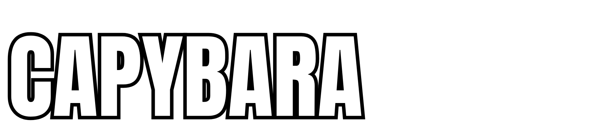

<p align="center">
  
</p>

<p align="center">
  <strong>A high-velocity arcade physics launch game built from scratch with pure Canvas 2D and the Web Audio API.</strong>
</p>

<p align="center">
  <a href="#-quick-start--playable-demo"></a>
  <a href="ARCHITECTURE.md"></a>
  <a href="DECISIONS.md"></a>
  <a href="LICENSE.md"></a>
  
</p>

---

## 🎯 Executive Overview

**Capybara Cannon** is a launch-physics web game inspired by arcade classics like *Kitten Cannon* and *Learn to Fly*, starring an unflappable, zen capybara soaring across procedurally generated wetlands.

Engineered deliberately with **zero external game frameworks or physics libraries**, this project demonstrates foundational game-engine craft: sub-stepped numerical integration, procedural spline terrain generation, real-time procedural audio synthesis, parametric vector rendering, dynamic camera tracking, and clean state machine architecture.

> **Showcase Status**: This repository is maintained as an open engineering showcase. Core mechanics, custom physics, architectural records, and playable builds are transparently presented, while commercial infrastructure and backend services remain safely decoupled.

---

## ⚡ Engineering Highlights

- **Bespoke Sub-Stepped Physics Solver**: Multi-pass Euler integration ($\Delta t / 4$) paired with Coulomb rolling resistance ($420\text{ px/s}^2$) and static slope locking, completely eliminating micro-gravity infinite sliding bugs common in web launch games.
- **Procedural Web Audio API Synthesis**: 100% of flight sound effects (cannon blasts, sub-bass thumps, trampoline boings, yuzu chimes, water splashes) are generated mathematically at runtime via frequency ramps, white-noise buffers, and biquad filters—zero external audio file payload for gameplay.
- **100% Visual Fidelity Title Screen**: Native 1920×1080 master artwork integrated with strict 16:9 letterbox scaling, precision-calibrated CSS hitboxes (`-8.8°` tilt on PLAY, SHOP, ACCOUNT), safe 33px neutral separation between SHOP and ACCOUNT, decorative art exclusion, invisible production mode, and an automated Playwright regression suite.
- **Parametric Vector Capybara**: Vector-rendered character with dynamic facial expressions (`zen`, `happy`, `surprised`, `dizzy`), velocity-driven rotational momentum, and bullet squash-and-stretch.
- **Zero-Dependency Modern Stack**: Built with modular ES6 JavaScript, HTML5 Canvas 2D, and CSS3. Instant load times (< 50ms) with zero build steps or npm vulnerabilities.

---

## 🕹️ Quick Start / Playable Demo

Because the game uses modern ECMAScript modules, it can be run instantly with any lightweight local web server:

### Option 1: Python (Built into macOS & Linux)
```bash
# Clone the repository and enter the directory
git clone https://github.com/RosenthalMark/CapybaraCannon.git
cd CapybaraCannon

# Launch local server
python3 -m http.server 8000
```
Open **`http://localhost:8000`** in any modern web browser.

### Option 2: Node.js / npx
```bash
npx serve .
```

---

## 🎮 How to Play

```
              [ CANNON CONTROLS ]
     ↑ / ↓  or  Drag Mouse ──► Aim Angle (5° - 85°)
     Hold SPACE or Launch   ──► Charge Power Meter
     Release                ──► FIRE CANNON! 💥
```

1. **Aim & Power**: Adjust barrel elevation with `↑`/`↓` arrow keys, `W`/`S`, or by clicking and dragging. Press and hold `SPACE` or the **LAUNCH** button to oscillate the power meter; release near the sweet spot for an explosive blast up to $3,100\text{ px/s}$.
2. **Zen Boost 🍊**: Press `SPACE` or tap the screen while airborne to consume your single emergency mid-flight boost for forward and upward momentum.
3. **Wetland Hazards & Boosters**:
   - 💥 **TNT Barrels**: Detonates with an explosive shockwave, propelling the capybara skyward.
   - 🍄 **Trampolines**: Super springy mushroom pads providing elastic bounce.
   - 🍊 **Floating Yuzus**: Citrus boosts granting temporary turbo speed and sparkle trails.
   - ♨️ **Hot Springs**: Healing mineral baths providing smooth, low-friction gliding.
   - 🌵 **Cacti**: Prickly wetland hazards that severely scrub velocity or halt sliding capybaras.
   - 🌾 **Mud Pits**: Zero-bounce bogs that trap sliding capybaras to a full stop.
4. **Arcade Leaderboard**: Set your distance record, enter your pilot initials if you reach the Top 3, and hit **RELAUNCH** to shoot again!

---

## 📚 Technical Documentation Suite

| Document | Purpose & Contents |
|:---|:---|
| 📐 [**ARCHITECTURE.md**](ARCHITECTURE.md) | Deep dive into the game loop, sub-stepped physics model, Coulomb friction formulas, rendering pipeline, and procedural audio graphs. |
| 📋 [**DECISIONS.md**](DECISIONS.md) | Architecture Decision Records (ADRs) explaining technical choices (Canvas vs Phaser, procedural audio, sub-stepped physics, IP boundary). |
| 🗺️ [**ROADMAP.md**](ROADMAP.md) | Master development roadmap detailing completed milestones (Feature 0.1), active phases, and the experimental ideas pool. |
| 📝 [**CHANGELOG.md**](CHANGELOG.md) | SemVer-compliant record of all releases, physics overhauls, and feature implementations. |
| 🔍 [**ASSET_REGISTRY.md**](ASSET_REGISTRY.md) | Complete intellectual property provenance tracking all artwork, audio, and code assets. |
| ⚖️ [**LICENSE.md**](LICENSE.md) | Proprietary showcase terms reserving commercial and distribution rights while enabling public portfolio review. |

---

## 🏛️ System State Architecture

The game lifecycle is governed by an explicit finite state machine:

```
[ TITLE ] ──(Click PLAY)──► [ AIMING ] ──(Hold Launch)──► [ CHARGING ]
    ▲                                                             │
    │                                                      (Release Launch)
    │                                                             ▼
[ GAMEOVER ] ◄──(Timer)─── [ STOPPED ] ◄──(Speed < 14)──── [ FLIGHT ]
 (Results & Leaderboard)
```

---

## ⚖️ Intellectual Property & Copyright Notice

**Copyright © 2026 Mark Rosenthal. All rights reserved.**

This repository is publicly visible for educational, portfolio, and technical demonstration purposes. Unless otherwise stated, the source code, game design, original characters, artwork, audio recordings, brand marks, and documentation contained herein may not be redistributed, commercially exploited, or rehosted without explicit prior written permission.

For corporate inquiries, licensing, or evaluation: **Mark Rosenthal**
